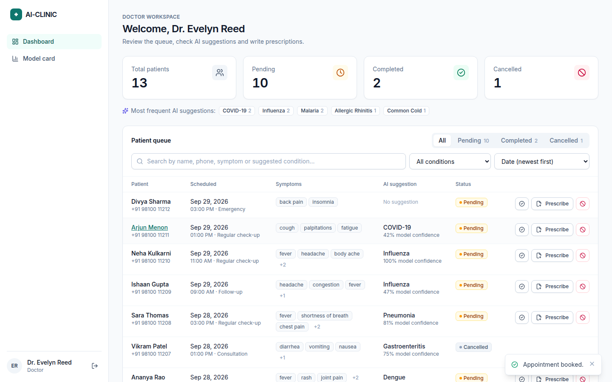
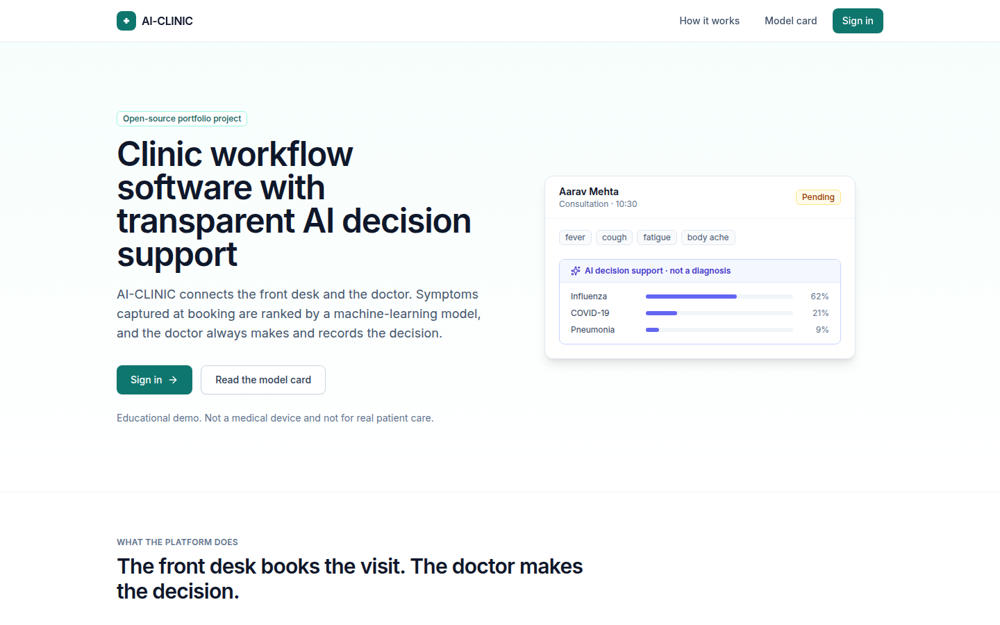
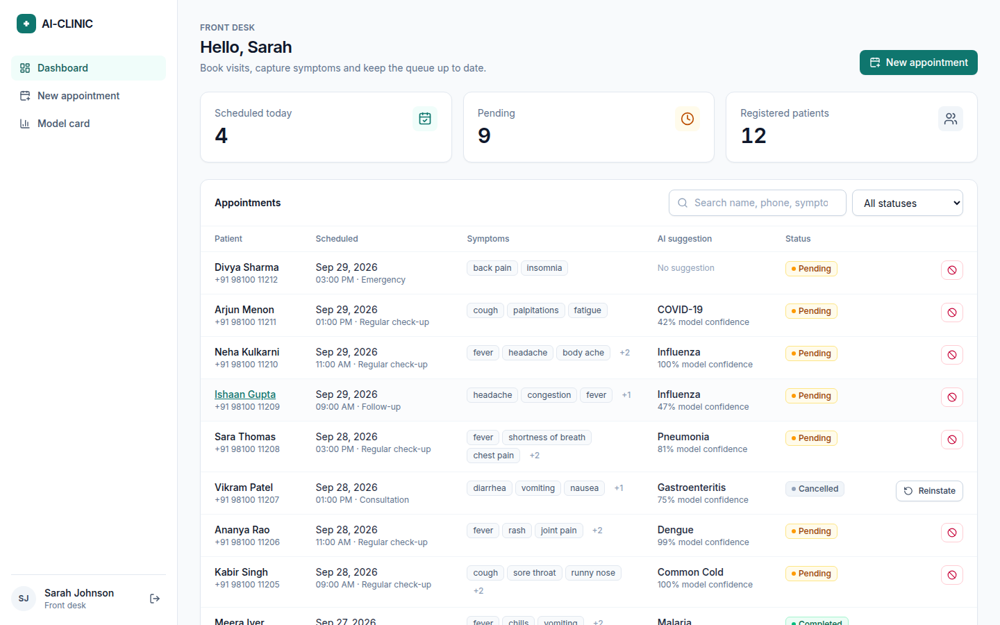
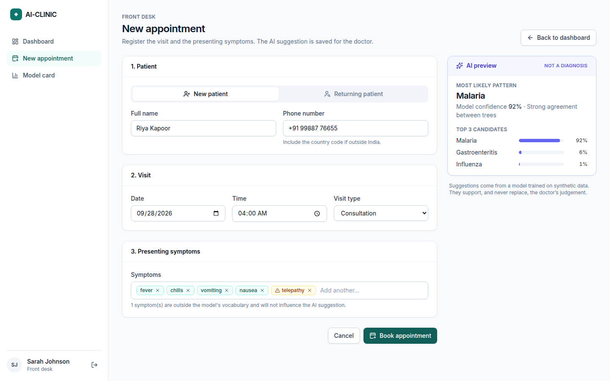
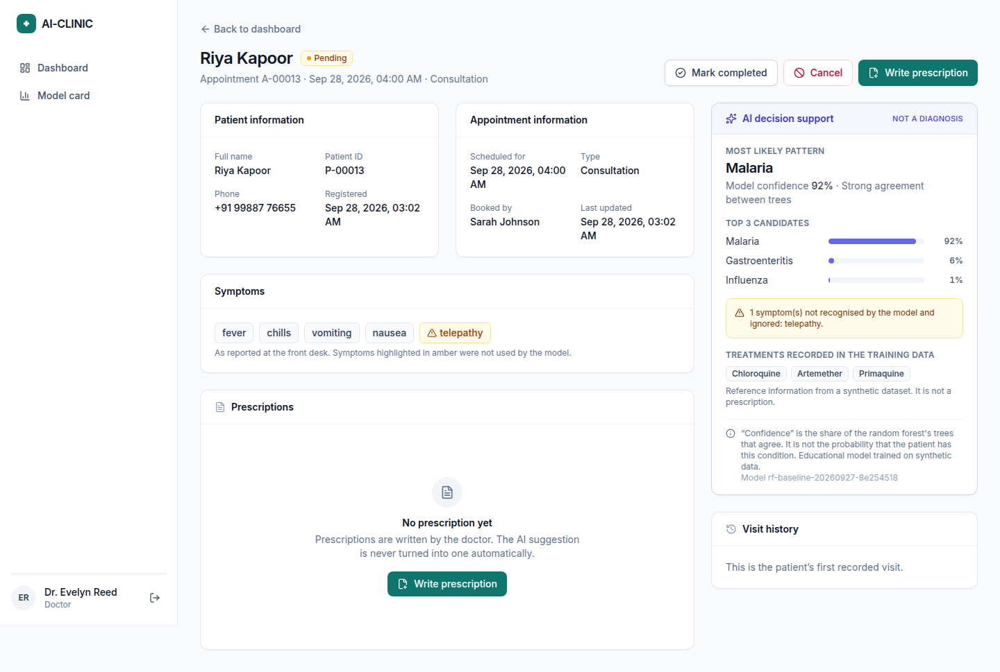
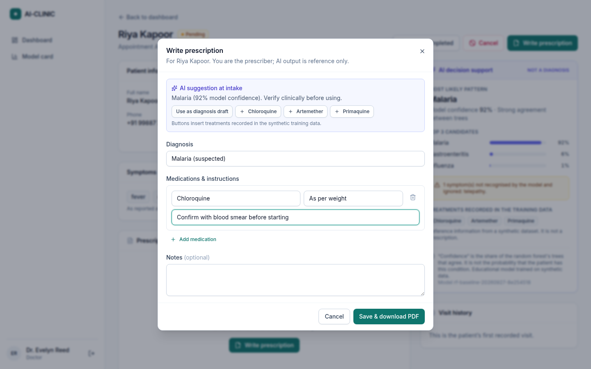
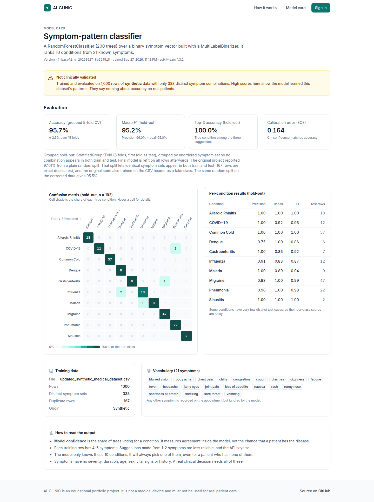
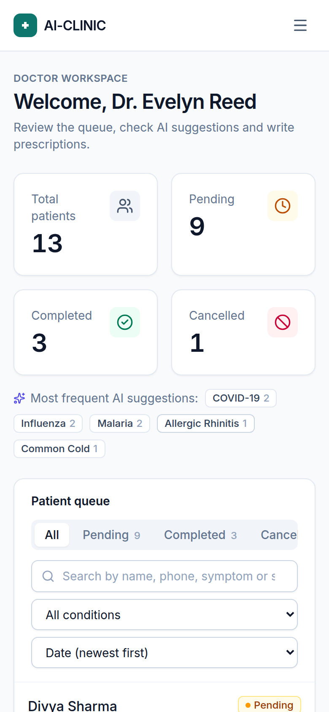

# AI-CLINIC

A full-stack clinic workflow app: a **React** front end, a **Flask REST API**, **MongoDB** (Atlas) persistence and a **scikit-learn** model that gives transparent, clearly-labelled decision support.

The front desk books visits and captures symptoms. A RandomForest model ranks the most likely conditions and says how much its trees agree. The doctor reviews the queue, decides, and writes a prescription that is exported as a PDF.

> ⚠️ **Educational project, not a medical device.** The model is trained on a small **synthetic** dataset and has **not been clinically validated**. Its output is decision support, not a diagnosis. Prescriptions are always written by a clinician. Do not enter real patient data.



## Contents

- [Overview](#overview)
- [Features](#features)
- [Architecture](#architecture)
- [Tech stack](#tech-stack)
- [ML model](#ml-model)
- [How it works](#how-it-works-end-to-end)
- [Project structure](#project-structure)
- [Installation](#installation)
- [Environment variables](#environment-variables)
- [Running locally](#running-locally)
- [API](#api-documentation)
- [ML training](#ml-training)
- [Testing](#testing)
- [Deployment](#deployment)
- [Limitations](#limitations)
- [Future improvements](#future-improvements)
- [Screenshots](#screenshots)
- [License](#license)

## Overview

This repository started as a single-file Flask app with HTML templates, vanilla JavaScript, an in-memory patient list and hard-coded client-side logins. It has been rebuilt as a maintainable full-stack application while **keeping its core ideas**: the two-portal workflow, the RandomForest + MultiLabelBinarizer model, the dataset-derived treatment lookup and ReportLab PDFs.

What changed and why is documented in [docs/ARCHITECTURE.md](docs/ARCHITECTURE.md). The ML pipeline, including a data-loading bug that was fixed and an honest re-evaluation of the old 97.01% accuracy claim, is covered in [docs/ML.md](docs/ML.md).

## Features

- **Role-based workflow.** Separate *front desk* and *doctor* workspaces. Permissions are enforced by the API: only the front desk books, only doctors complete visits and prescribe.
- **Front desk dashboard.** Today's and pending counts, a searchable and filterable appointment list, cancel and reinstate.
- **Appointment booking.** New or returning patient (typeahead search by name or phone), date, time, visit type, and symptom chips with autocomplete from the model's vocabulary. Unknown symptoms are flagged.
- **Live AI preview** while typing symptoms, and a booking summary with the stored suggestion.
- **Doctor dashboard.** Total, pending, completed and cancelled counts, the most frequent AI suggestions, a patient queue with search, status tabs, condition filter, sort and pagination (all kept in the URL).
- **Patient/appointment details.** Patient and appointment information, symptoms, AI suggestion (top 3 with warnings), dataset reference treatments, prescriptions and visit history.
- **AI-assisted prediction.** Top-k ranked conditions with *model confidence* (tree agreement), confidence level, explicit unknown-symptom handling, and model version stamped on each prediction.
- **Doctor-authored prescriptions.** Diagnosis, medications (name, dosage, instructions) and notes. AI and dataset hints are inserted only by an explicit click.
- **Professional PDF export** (ReportLab) with the AI suggestion clearly separated from the prescription.
- **Persistent database.** MongoDB (works with a free MongoDB Atlas cluster): users, patients, appointments with their embedded AI suggestion, and prescriptions, with indexes and audit timestamps.
- **REST API** with JWT auth, server-side validation, consistent JSON errors, structured logging and a health check.
- **Public model card** page with grouped cross-validation metrics, a per-class table and a confusion matrix.
- **Tests.** 80 pytest tests (API, auth, validation, ML, PDF, database outage), which run on an in-memory MongoDB emulator or a real MongoDB server, and 19 Vitest tests (auth flow, API client, symptom input, booking flow).

## Architecture

```
          React SPA (Vite, Tailwind, React Router, TanStack Query)
                              │
                     HTTP/JSON + JWT bearer token
                              │
                  Flask REST API  (blueprints: routes/)
                              │
            validators ── services (business rules) ── auth
                              │
        ┌─────────────────────┼──────────────────────┐
        │                     │                      │
   PyMongo documents     ML predictor           PDF service
   MongoDB (Atlas)       scikit-learn           ReportLab
                         (loaded once)
                              ▲
             offline: scripts/train_model.py → models/*.joblib
```

Flask does not render pages. The React app is a separate static site that calls the API. See [docs/ARCHITECTURE.md](docs/ARCHITECTURE.md) for the request lifecycle, data model and the reasoning behind each choice.

## Tech stack

| Layer | Technology |
| --- | --- |
| Frontend | React 19, Vite, Tailwind CSS 4, React Router, TanStack Query, lucide-react icons |
| Backend | Python 3.11, Flask 3 (app factory + blueprints), PyJWT, flask-cors |
| Database | MongoDB (Atlas or self-hosted) via PyMongo, Stable API v1 |
| ML | scikit-learn `RandomForestClassifier` + `MultiLabelBinarizer`, pandas, joblib |
| PDF | ReportLab (Platypus) |
| Testing | pytest, pypdf, mongomock · Vitest, Testing Library, jsdom |

## ML model

| | |
| --- | --- |
| Algorithm | `RandomForestClassifier(n_estimators=200, random_state=42)`, the original configuration, kept on purpose |
| Features | 21 binary symptom indicators from a `MultiLabelBinarizer` |
| Classes | 10 conditions (Allergic Rhinitis, COVID-19, Common Cold, Dengue, Gastroenteritis, Influenza, Malaria, Migraine, Pneumonia, Sinusitis) |
| Data | `data/updated_synthetic_medical_dataset.csv`: 1,000 **synthetic** rows, only 338 distinct symptom combinations, 167 exact duplicates |
| Output | top-3 conditions, each with a vote share ("model confidence"), plus warnings for unknown or too few symptoms |

**Evaluation** uses grouped splits, so identical symptom sets never appear in both train and test:

| Protocol | Accuracy |
| --- | --- |
| Old README figure (original code, random split) | 97.01%, inflated by duplicate leakage **and** a bug that trained on the CSV header as a fake class |
| **Grouped 5-fold CV × 3 seeds (headline)** | **95.67% ± 2.33%** (macro F1 93.4%) |
| Grouped hold-out (n = 192) | 97.40% accuracy · 95.15% macro F1 · 100% top-3 |

A tuned configuration was compared and **not adopted**: +0.6 pp accuracy (within noise) at the cost of worse log loss. "Model confidence" is tree agreement, not a clinical probability; the model is actually under-confident on this data (mean 0.81 vs 97% accuracy). Full details, including maths, the confusion matrix and limitations, are in **[docs/ML.md](docs/ML.md)**.

## How it works (end to end)

```
Front desk enters: Riya Kapoor · +91 99887 76655 · consultation · fever, chills, vomit, nausea, telepathy
   │
   ▼  POST /api/appointments   (JWT, role = frontdesk)
Validation         name/phone/date/type/symptoms checked; "vomit" → "vomiting" (alias)
   │
   ▼
ML preprocessing   known: fever, chills, vomiting, nausea · unknown: telepathy (ignored, flagged)
   │               → 21-dim 0/1 vector
   ▼
RandomForest       200 trees vote → Malaria 0.92 · Gastroenteritis 0.06 · Influenza 0.01
   │
   ▼
MongoDB            patients doc + appointments doc (status=pending, prediction embedded, model_version=rf-…)
   │
   ▼
Doctor dashboard   queue row "Riya Kapoor · Malaria · 92% model confidence"
   │
   ▼
Doctor             reviews, writes "Malaria (suspected)" + medications → POST /api/prescriptions
   │
   ▼
PDF                GET /api/prescriptions/3/pdf → prescription_RX-000003.pdf
```

## Project structure

```
AI-CLINIC/
├── client/                         React SPA
│   ├── src/
│   │   ├── components/             AppointmentList, SymptomInput, PredictionCard, PrescriptionDialog, …
│   │   │   ├── layout/             AppShell, PublicLayout, ProtectedRoute, Logo
│   │   │   └── ui/                 Modal, States (loading/empty/error), StatusBadge, Field
│   │   ├── context/                AuthContext, ToastContext
│   │   ├── hooks/                  queries.js (TanStack Query), useStatusChange, useDebouncedValue
│   │   ├── lib/                    api.js, format.js, constants.js, symptoms.js
│   │   ├── pages/                  Home, Login, FrontDesk, NewAppointment, DoctorDashboard,
│   │   │                           AppointmentDetails, ModelInfo, NotFound
│   │   ├── test/                   Vitest tests
│   │   ├── App.jsx · main.jsx · index.css
│   ├── .env.example · package.json · vite.config.js
│
├── server/                         Flask REST API
│   ├── app/
│   │   ├── __init__.py             create_app() factory
│   │   ├── config.py · extensions.py · errors.py · logging_config.py · auth.py · cli.py
│   │   ├── routes/                 health, auth, appointments, patients, predictions, prescriptions
│   │   ├── services/               appointment, patient, prediction, prescription, pdf
│   │   ├── models/                 user, patient, appointment, prediction, prescription
│   │   ├── ml/                     preprocessing, artifacts, predictor, training
│   │   └── utils/                  validators, responses
│   ├── scripts/                    train_model.py, evaluate_model.py
│   ├── tests/                      pytest suites
│   ├── requirements.txt · requirements-dev.txt · pytest.ini · wsgi.py
│
├── data/updated_synthetic_medical_dataset.csv
├── models/                         disease_model.joblib, mlb.joblib, model_metadata.json
├── docs/                           ARCHITECTURE.md, ML.md, API.md, screenshots/
├── .env.example · .gitignore · README.md
```

## Installation

Prerequisites: **Python 3.10–3.12**, **Node.js 22.22+** (or 24+; required by React Router 8 and Vitest), and a **MongoDB** database. A free [MongoDB Atlas](https://www.mongodb.com/atlas) cluster works; so does a local `mongod`.

**Atlas setup (once):** in the Atlas UI, create a database user (Database Access), then allow your IP under **Network Access** (or `0.0.0.0/0` for a throwaway demo cluster). Copy the connection string from **Connect → Drivers**. If your IP is not allowed, connections simply time out, and the API reports `"database": "unavailable"` on `/api/health`.

```bash
git clone https://github.com/Shoaib1M/AI-CLINIC.git
cd AI-CLINIC

# 1. Configuration
cp .env.example .env
#    then edit .env and set:
#      MONGODB_URI=mongodb+srv://<user>:<password>@<cluster>.mongodb.net/?retryWrites=true&w=majority
#      JWT_SECRET=...   (python -c "import secrets; print(secrets.token_urlsafe(48))")
#      DEMO_DOCTOR_PASSWORD=...  DEMO_FRONTDESK_PASSWORD=...   (8+ characters each)

# 2. Backend
cd server
python -m venv .venv
source .venv/bin/activate            # Windows: .venv\Scripts\activate
pip install -r requirements-dev.txt  # requirements.txt alone for production
flask --app wsgi seed-demo --with-appointments   # creates indexes, demo accounts and sample visits

# 3. Frontend
cd ../client
npm install
```

The trained model is committed in `models/`, so no training is needed to run the app.

## Environment variables

The API reads `.env` at the repository root; real environment variables take precedence. See [.env.example](.env.example).

| Variable | Default | Purpose |
| --- | --- | --- |
| `APP_ENV` | `development` | `development`, `production` or `testing` |
| `JWT_SECRET` | *(none)* | Token signing key, ≥ 32 chars. **Required in production.** In development a random one is generated per run (you get logged out on restart). |
| `JWT_EXPIRES_MINUTES` | `480` | Token lifetime |
| `MONGODB_URI` | *(none)* | **Required.** MongoDB connection string (`mongodb+srv://…` for Atlas, `mongodb://localhost:27017` locally). Keep it in `.env`; never commit it. |
| `MONGODB_DB` | `ai_clinic` | Database name inside the cluster (created on first write) |
| `MONGODB_TIMEOUT_MS` | `5000` | How long to wait for the cluster before answering `503 DATABASE_UNAVAILABLE` |
| `MODEL_DIR` | `models` | Model artifact directory |
| `DATASET_PATH` | `data/updated_synthetic_medical_dataset.csv` | Training data |
| `CORS_ORIGINS` | `http://localhost:5173` | Comma-separated browser origins allowed to call the API |
| `CLINIC_NAME`, `CLINIC_ADDRESS` | demo values | Printed on PDFs |
| `LOG_LEVEL`, `LOG_FORMAT` | `INFO`, `text` | `LOG_FORMAT=json` gives one JSON object per line |
| `DEMO_DOCTOR_PASSWORD`, `DEMO_FRONTDESK_PASSWORD` | *(none)* | Used only by `flask seed-demo` |

Client (`client/.env`, optional): `VITE_API_URL`. Leave it empty locally (Vite proxies `/api` to Flask); in production set it to the API's public URL.

No credentials exist in the source code. To add real staff accounts:

```bash
cd server
flask --app wsgi create-user drsmith --role doctor --full-name "Dr. Jane Smith"   # prompts for a password
```

## Running locally

You need **two terminals**.

```bash
# Terminal 1: API on http://127.0.0.1:5000
cd server && source .venv/bin/activate
flask --app wsgi run --debug

# Terminal 2: React app on http://localhost:5173
cd client
npm run dev
```

Open http://localhost:5173 and sign in as `doctor1` or `frontdesk1` with the passwords you put in `.env`. Check the API with `curl http://127.0.0.1:5000/api/health`.

## API documentation

Full reference with request/response examples and error codes: **[docs/API.md](docs/API.md)**.

| Method | Endpoint | Auth | Purpose |
| --- | --- | --- | --- |
| GET | `/api/health` | public | Liveness/readiness (DB + model) |
| POST | `/api/auth/login` | public | Credentials → JWT |
| GET | `/api/auth/me` | any | Current user |
| GET | `/api/appointments` | doctor, frontdesk | Search/filter/sort/paginate |
| POST | `/api/appointments` | frontdesk | Book + store AI suggestion |
| GET | `/api/appointments/stats` | doctor, frontdesk | Dashboard counts |
| GET | `/api/appointments/:id` | doctor, frontdesk | Full record + visit history |
| PATCH | `/api/appointments/:id` | doctor, frontdesk | Status (validated transitions), reschedule |
| GET | `/api/patients?q=` | doctor, frontdesk | Returning-patient typeahead |
| POST | `/api/predictions` | doctor, frontdesk | Stateless top-k prediction |
| GET | `/api/model` | public | Model card: vocabulary, classes, metrics |
| POST | `/api/prescriptions` | doctor | Doctor-authored prescription |
| GET | `/api/prescriptions/:id` | doctor, frontdesk | Read prescription |
| GET | `/api/prescriptions/:id/pdf` | doctor, frontdesk | Download PDF |

Success responses look like `{"data": …, "meta"?: …}`; errors look like `{"error": {"code", "message", "details"?}}`.

## ML training

Training is an explicit offline step. The web app only loads artifacts and never retrains.

```bash
cd server
python -m scripts.train_model                 # train + evaluate + write models/ (≈10 s)
python -m scripts.train_model --config tuned  # alternative hyper-parameters
python -m scripts.evaluate_model              # report: metrics, per-class, confusion matrix, protocol comparison
python -m scripts.evaluate_model --compare    # grouped CV for every config
```

Restart the API after retraining. `model_metadata.json` records the version, dataset hash and all metrics, and `evaluate_model` warns if the CSV changed after training. The scikit-learn version is pinned because pickled models are tied to the version that created them.

## Testing

```bash
cd server && pytest          # 79 tests on an in-memory MongoDB emulator (1 integration test skipped)
cd client && npm test        # 19 tests: login + route guards, API client, symptom input, booking flow, prediction card
```

By default the backend tests use **mongomock**, an in-memory MongoDB emulator, so they need no database or network. To run the **whole suite against a real MongoDB** instead (each test gets a throwaway `ai_clinic_test_*` database that is dropped afterwards), set `TEST_MONGODB_URI`. This also enables the integration test, which checks persistence across an app restart:

```bash
cd server && TEST_MONGODB_URI="mongodb+srv://<user>:<password>@<cluster>.mongodb.net/" pytest   # 80 tests
```

## Deployment

The two halves deploy independently.

**API** (any Python host such as Render, Railway, Fly.io or a VM):

```bash
cd server
pip install -r requirements.txt
APP_ENV=production JWT_SECRET=<48+ random chars> MONGODB_URI=<your connection string> \
  CORS_ORIGINS=https://your-frontend.example gunicorn -w 2 -b 0.0.0.0:$PORT wsgi:app
```

- Set `APP_ENV=production`. The app refuses to start without a strong `JWT_SECRET`, and debug is off.
- Use `LOG_FORMAT=json` for log aggregation, and point your platform's health check at `/api/health`.
- Set `MONGODB_URI` as a secret on the host. In Atlas, allow the host's outbound IPs under Network Access. The app keeps no local state, so any number of instances can share the cluster.
- Create accounts with `flask --app wsgi create-user …` on the server.
- Each gunicorn worker loads the model once (~1 MB) at startup.

**Client** (any static host such as Netlify, Vercel, Cloudflare Pages or S3):

```bash
cd client
VITE_API_URL=https://your-api.example npm run build   # outputs client/dist/
```

Configure the host to serve `index.html` for unknown paths (SPA fallback) and add that origin to the API's `CORS_ORIGINS`. Serve both over HTTPS.

## Limitations

- **Synthetic data, not clinically validated.** 1,000 rows with 338 distinct combinations of 21 symptoms. The metrics describe this dataset, not real patients.
- **Decision support only.** The model always picks one of 10 conditions, has no "none of these" or urgency output, and ignores severity, duration, demographics, vitals and history.
- **Model confidence ≠ probability of disease.** It is tree agreement and is not calibrated.
- **Reference treatments** come from the dataset (5 of 10 conditions have none) and are never used as prescriptions automatically.
- **Authentication scope.** JWT in `localStorage`, with no refresh tokens, login rate limiting, password reset or MFA. Accounts are created from the CLI.
- **Persistence.** MongoDB without schema validation or migrations; the document shapes are enforced by the API's validators. Multi-document writes (patient then appointment) are not wrapped in a transaction.
- **Single clinic, no doctor assignment.** All doctors share one queue.
- **Not compliant with health-data regulations** (HIPAA, GDPR, DPDP): no encryption at rest, audit trail UI, consent or data-retention policy.

## Future improvements

- MongoDB JSON-schema validators on each collection, and transactions for multi-document writes
- HttpOnly cookie sessions with CSRF protection, refresh tokens, login rate limiting
- Assign appointments to specific doctors; calendar/day view with slot conflict detection (`409`)
- Record the doctor's final diagnosis to measure model agreement over time (a feedback loop)
- A richer, real, de-identified dataset; calibrated probabilities; an explicit "uncertain / refer" output
- Audit log view (who changed what, when)
- Dockerfile + docker-compose, and CI (GitHub Actions) running both test suites
- Playwright end-to-end tests in CI

## Screenshots

| | |
| --- | --- |
| **Landing page**<br> | **Front desk dashboard**<br> |
| **New appointment with live AI preview**<br> | **Doctor dashboard**<br> |
| **Appointment details**<br> | **Doctor-authored prescription**<br> |
| **Model card**<br> | **Mobile**<br> |

## License

This repository does not include a license file, so by default all rights are reserved by the author. Add a `LICENSE` file (for example MIT) if you want others to reuse the code.
